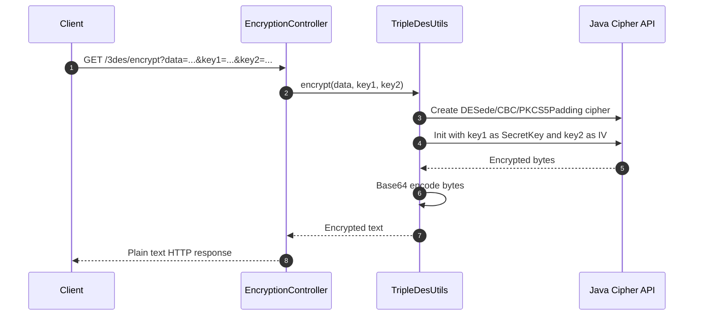
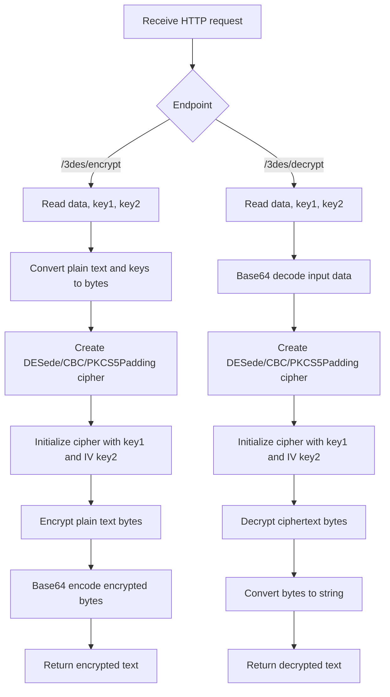

# Triple-DES Service

`Triple-DES` is a Spring Boot service that exposes HTTP endpoints for encrypting and decrypting text using the `DESede` algorithm (Triple DES) in `CBC` mode with `PKCS5Padding`.

The service accepts:

- `data`: plain text for encryption, or Base64 ciphertext for decryption
- `key1`: the Triple DES secret key
- `key2`: the initialization vector (IV)

The application runs on port `8081` by default.

## Overview

- Framework: Spring Boot `3.1.0`
- Java: `17` configured in Gradle
- Web stack: Spring WebFlux
- Cipher: `DESede/CBC/PKCS5Padding`
- Response type: plain text

## How It Works

The service has two endpoints under `/3des`:

- `GET /3des/encrypt`
- `GET /3des/decrypt`

For encryption:

1. The controller receives `data`, `key1`, and `key2` as query parameters.
2. The service converts the input text and keys to byte arrays.
3. It creates a `DESede/CBC/PKCS5Padding` cipher.
4. It uses `key1` as the Triple DES key and `key2` as the IV.
5. It encrypts the input text.
6. It Base64-encodes the encrypted bytes and returns the result as plain text.

For decryption:

1. The controller receives Base64 ciphertext in `data`.
2. The service Base64-decodes the ciphertext.
3. It creates the same cipher configuration.
4. It uses the same `key1` and `key2`.
5. It decrypts the bytes.
6. It returns the original plain text as plain text.

## Request Parameters

All parameters are passed as query parameters.

| Name | Required | Description |
| --- | --- | --- |
| `data` | Yes | Plain text to encrypt, or Base64 ciphertext to decrypt |
| `key1` | Yes | Triple DES key. Intended to be `24` bytes |
| `key2` | Yes | IV for CBC mode. Intended to be `8` bytes |

## API Endpoints

### 1. Encrypt

**Request**

```http
GET /3des/encrypt?data=HelloWorld&key1=VUeEYVqeHVJGrJTgrPDRdxzz&key2=fQe8QZh1
```

**cURL**

```bash
curl -G "http://localhost:8081/3des/encrypt" \
  --data-urlencode "data=HelloWorld" \
  --data-urlencode "key1=VUeEYVqeHVJGrJTgrPDRdxzz" \
  --data-urlencode "key2=fQe8QZh1"
```

**Sample Response**

```text
6lcEU7S4h/4Lx9sB+3M4fg==
```

Response is returned as plain text, not JSON.

### 2. Decrypt

**Request**

```http
GET /3des/decrypt?data=6lcEU7S4h/4Lx9sB+3M4fg==&key1=VUeEYVqeHVJGrJTgrPDRdxzz&key2=fQe8QZh1
```

**cURL**

```bash
curl -G "http://localhost:8081/3des/decrypt" \
  --data-urlencode "data=6lcEU7S4h/4Lx9sB+3M4fg==" \
  --data-urlencode "key1=VUeEYVqeHVJGrJTgrPDRdxzz" \
  --data-urlencode "key2=fQe8QZh1"
```

**Sample Response**

```text
HelloWorld
```

Response is returned as plain text, not JSON.

## Request and Response Summary

### Encrypt

**Input**

```text
data  = HelloWorld
key1  = VUeEYVqeHVJGrJTgrPDRdxzz
key2  = fQe8QZh1
```

**Output**

```text
6lcEU7S4h/4Lx9sB+3M4fg==
```

### Decrypt

**Input**

```text
data  = 6lcEU7S4h/4Lx9sB+3M4fg==
key1  = VUeEYVqeHVJGrJTgrPDRdxzz
key2  = fQe8QZh1
```

**Output**

```text
HelloWorld
```

## Process Description Diagram



## Encryption and Decryption Flowchart



## Project Structure

```text
src/main/java/com/example/
├── TripleDesApplication.java
├── EncryptionController.java
└── TripleDesUtils.java

src/main/resources/
└── application.properties
```

## Running The Service

### Start with Gradle

```bash
./gradlew bootRun
```

The service will start at:

```text
http://localhost:8081
```

## Configuration

Configured in [src/main/resources/application.properties](/home/mehedi/Celloscope/projects/Triple-DES-master/src/main/resources/application.properties:1):

```properties
server.port=8081
spring.application.name=Triple-DES
```

The file also contains commented sample values for:

- `key1`
- `key2`
- algorithm name

## Code Mapping

### `TripleDesApplication`

Application bootstrap class. Starts the Spring Boot application.

### `EncryptionController`

Defines the HTTP API:

- `/3des/encrypt`
- `/3des/decrypt`

Delegates all crypto operations to `TripleDesUtils`.

### `TripleDesUtils`

Contains the actual encryption and decryption logic:

- creates the cipher instance
- initializes the key and IV
- performs encryption or decryption
- Base64-encodes encrypted output

## Important Notes

- This service uses `GET` requests with secret values in query parameters.
- Query parameters can be logged by browsers, proxies, and servers.
- The service returns plain text, not JSON.
- There is no request validation layer for key length or malformed input.
- The code logs encrypted and decrypted values.
- Triple DES is a legacy algorithm. New systems usually prefer AES-based encryption.

## Testing

Run tests with:

```bash
./gradlew test
```

Current test coverage is minimal. The repository only contains a Spring context load test.

## Suggested Improvements

- Change endpoints from `GET` to `POST`
- Accept a JSON request body instead of query parameters
- Remove sensitive data from logs
- Validate key length before attempting encryption or decryption
- Add exception handling with clear HTTP error responses
- Add unit tests for successful and invalid inputs
- Consider AES-GCM for modern encryption requirements
